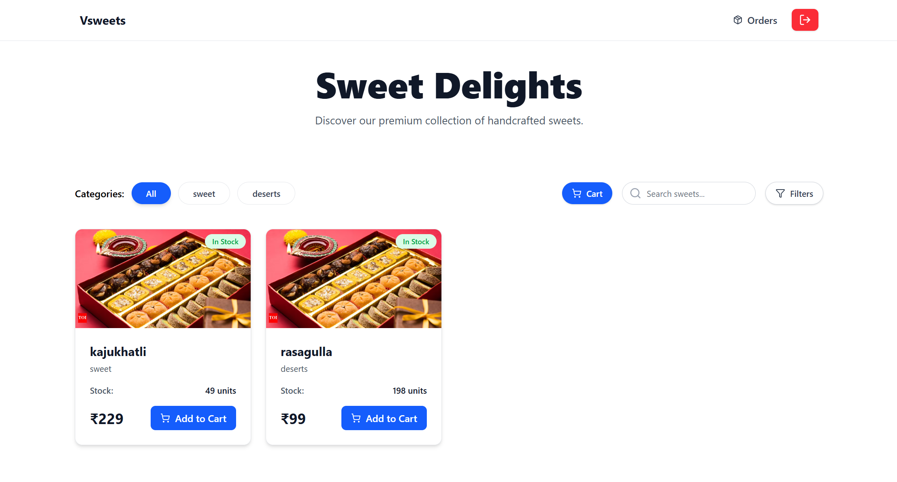
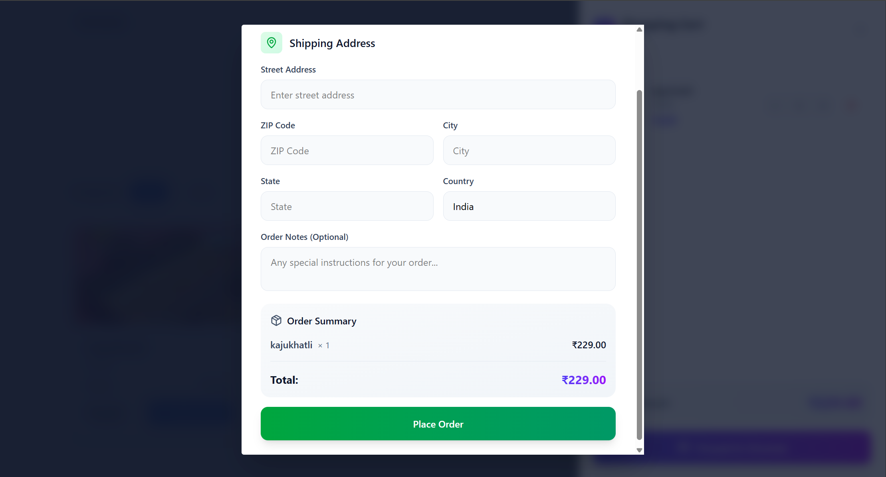
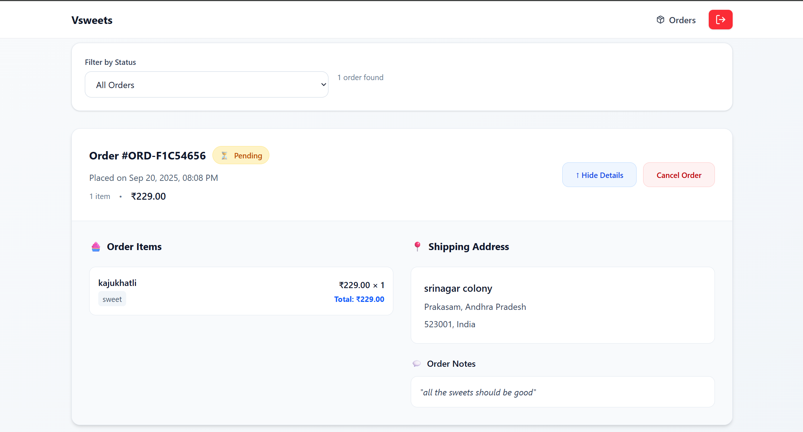
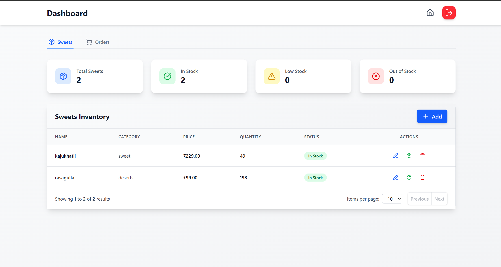
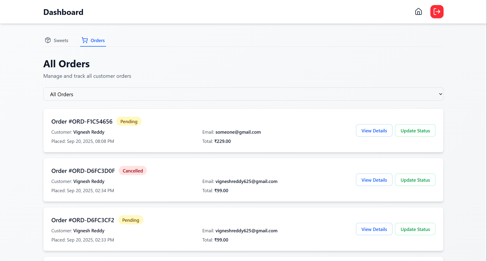

# Incubyte Sweets Shop

An end-to-end full-stack web application for managing a sweets shop, featuring user authentication, product management, order processing, and an admin dashboard.

---

## Table of Contents
- [Features](#features)
- [Tech Stack](#tech-stack)
- [Project Structure](#project-structure)
- [Backend Setup](#backend-setup)
- [Frontend Setup](#frontend-setup)
- [API Endpoints](#api-endpoints)
- [Screenshots](#screenshots)

---

## Features

- User authentication (signup, login, logout, JWT-based sessions)
- Browse, search, and filter sweets
- Shopping cart and order placement
- View user order history
- Admin dashboard for managing sweets and orders
- Admin can create, edit, restock, and delete sweets
- Admin can view and update all orders
- Responsive UI with modern design

---

## Tech Stack

- **Frontend:** React, Vite, Tailwind CSS, Axios, React Router
- **Backend:** Node.js, Express, MongoDB, Mongoose, JWT, bcryptjs
- **Dev Tools:** Docker, Nodemon, Prettier, ESLint

---

## Project Structure

```
Incubyte/
	Backend/         # Express backend API
		src/
			controllers/  # Route controllers
			models/       # Mongoose models
			routes/       # API route definitions
			middlewares/  # Auth and validation middleware
			utils/        # Utility functions
			db/           # DB connection
		Dockerfile      # Docker setup for backend
		package.json    # Backend dependencies
	Frontend/        # React frontend
		src/
			components/   # React components
			contexts/     # React context providers
			config/       # API config
		package.json    # Frontend dependencies
		vite.config.js  # Vite config
	Readme.md         # Project documentation
```

---


## Backend Environment Variables

Create a `.env` file in the `Backend/` directory with the following variables:

```
PORT                # Port for backend server (default: 5000)
MONGODB_URI              # MongoDB connection string
CLIENT_URL               # Frontend client URL
BCRYPT_SALT_ROUNDS       # bcrypt salt rounds (default: 12)
ACCESS_TOKEN_SECRET      # Secret for signing access tokens
ACCESS_TOKEN_EXPIRES_IN  # Access token expiry (default: 15m)
REFRESH_TOKEN_SECRET     # Secret for signing refresh tokens
REFRESH_TOKEN_EXPIRES_IN # Refresh token expiry (default: 7d)
NODE_ENV                 # 'development' or 'production'
```

> **Note:**
> - Use strong, random values for the token secrets in production.
> - Adjust `CLIENT_URL` and `MONGODB_URI` as per your deployment.

---
## Backend Setup

1. **Install dependencies:**
	 ```sh
	 cd Backend
	 npm install
	 ```

2. **Configure environment variables:**
	 - Create a `.env` file in `Backend/` with the following variables:
		 ```env
		 PORT=5000
		 MONGODB_URI=mongodb://localhost:27017
		 JWT_SECRET=your_jwt_secret
		 CLIENT_URL=http://localhost:5173
		 NODE_ENV=development
		 BCRYPT_SALT_ROUNDS=12
		 ```

3. **Run the backend server:**
	 ```sh
	 npm run dev
	 ```
	 The server will start on `http://localhost:5000`.

4. **(Optional) Run with Docker:**
	 ```sh
	 docker build -t incubyte-backend .
	 docker run -p 5000:5000 --env-file .env incubyte-backend
	 ```

---

## Frontend Setup

1. **Install dependencies:**
	 ```sh
	 cd Frontend
	 npm install
	 ```

2. **Configure environment variables:**
	 - Create a `.env` file in `Frontend/` with:
		 ```env
		 VITE_API_BASE_URL=http://localhost:5000/api/v1
		 ```

3. **Run the frontend app:**
	 ```sh
	 npm run dev
	 ```
	 The app will be available at `http://localhost:5173`.

---

## API Endpoints

### Auth APIs (`/api/v1/auth`)

- `POST /signup` — Register a new user
- `POST /login` — Login and receive tokens
- `POST /refresh-token` — Refresh JWT access token
- `POST /logout` — Logout user
- `GET /profile` — Get current user profile (protected)

### Sweets APIs (`/api/v1/sweets`)

- `GET /` — List all sweets (pagination supported)
- `GET /search` — Search sweets by name/category
- `POST /` — Create a new sweet (admin only)
- `PATCH /:id` — Update sweet details (admin only)
- `DELETE /:id` — Delete a sweet (admin only)
- `POST /:id/restock` — Restock a sweet (admin only)
- `POST /:id/purchase` — Purchase a sweet (user only)

### Orders APIs (`/api/v1/orders`)

- `POST /create` — Place a new order (user only)
- `GET /my-orders` — Get current user's orders
- `GET /:orderId` — Get order details by ID
- `PATCH /:orderId/cancel` — Cancel an order (user only)
- `GET /admin/all` — Get all orders (admin only)
- `PATCH /admin/:orderId/status` — Update order status (admin only)

---

## Main Features

- **User:**
	- Register, login, and manage profile
	- Browse and search sweets
	- Add sweets to cart and place orders
	- View and cancel own orders

- **Admin:**
	- Manage sweets (CRUD, restock)
	- View and manage all orders
	- Update order statuses

---

## Screenshots

### Home Page


### Shop Page


### Shopping Cart / Purchase


### Orders Page


### Login Page


### Signup Page


### Admin Dashboard



### Admin Orders


---

## AI Usage

For this project, I leveraged **Cursor ClaudeAI** extensively to generate boilerplate code for both the frontend and backend. The AI assisted in setting up project structure, creating initial React components, Express routes, models, and utility functions, which helped accelerate the development process.

While most of the repetitive and foundational code was generated using AI, I manually implemented and refined several features, handled business logic, and customized components to fit the project requirements. I also used AI to debug, refactor, and optimize code, as well as to generate documentation and code comments.

This hybrid approach allowed me to focus on the unique aspects of the application while ensuring rapid and consistent code generation for standard patterns. The collaboration with AI tools like Cursor ClaudeAI made the development process more efficient and productive.